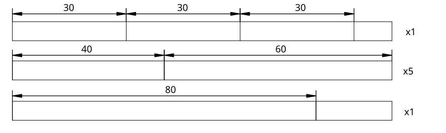

# cutlist

This is a simple [GNU Octave](https://octave.org/) program that
calculates optimal cut list based on a number and a length of required
pieces of timber and a length of available stock.

## Disclaimer

This code is beta. Before cutting mark your cuts and make sure that
you you are getting correct number of pieces of correct length.

## How it works

The problem is represented as a linear programming problem. The
program generates all possible/meaningful permutations of possible
cuts. Then finds an optimal solution by minimizing the offcut while
making sure that pieces can be cut out of a stock of defined length.

## Example

Let's assume that you are making a project which calls for:


  * 3 pieces of timber, 30 units of length each
  * 5 pieces of timber, 40 units of length each
  * 5 pieces of timber, 60 units of length each
  * and one piece of timber 80 units long.

Your supplier offers stock that is a 100 units long.

You would like to know how much stock you have to but and how to
arrange the cuts to get all required pieces of timber.

To get the answer for above problem make sure that the following
variables in code are set to:

```
stock = 100;
elements = [30 40 60 80]';
order = [3 5 5 1]';
```

* "stock" is length of your stock
* "elements" is length of each piece 
* "order" is required number of pieces of each length

Run the code in the terminal:

```
$ octave cutlist.m
```

You should get the following table at the end of the output. I don't
like the formatting. If you have a better idea, don't hesitate to send
a PR.

```
30	40	60	80	| offcut	| number of cut patters	
--------------------------------|
3	0	0	0	| 10		| 1
0	1	1	0	| 0		| 5
0	0	0	1	| 20		| 1
sum of offcuts: 30
```

Here is a drawing that will help you figure out how to read the
table. The program does not output such pictures.



## Tips

Inspect your timber before you cut it. Rearrange your cuts so that
your final pieces are free of defects (ex. knots at locations of
joints, grain prone to splitting). Expect some loss of stock.

<!-- Your timber might have sections that are no good for your project -->
<!-- (ex. knots, grain prone to splitting). -->

To give me some room while planning/rearranging the cuts I assume that
my stock is 10% shorter than what I can actually buy.

If you would like to accommodate for a saw kerf then add a width of
your saw kerf to the length of each piece. Remember that this program
operates on integers. Convert all dimensions (length of stock, length
of required pieces and a saw kerf) to the same units
(ex. millimeters).

